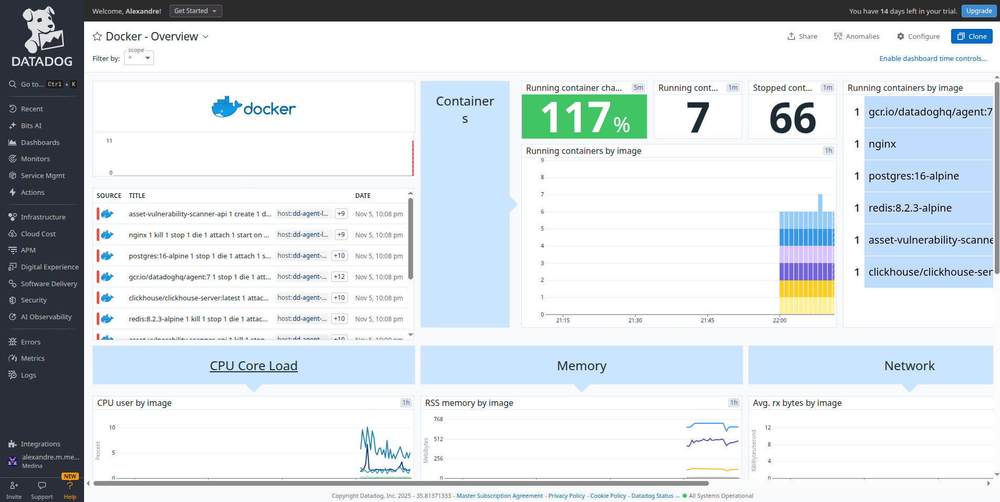
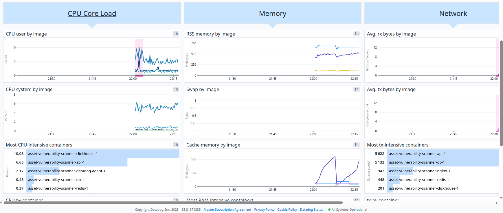
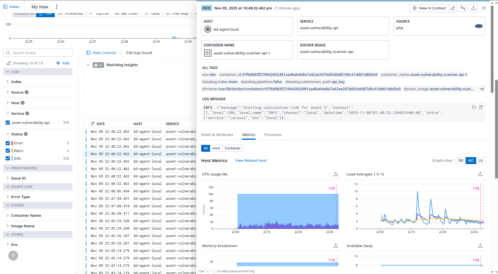
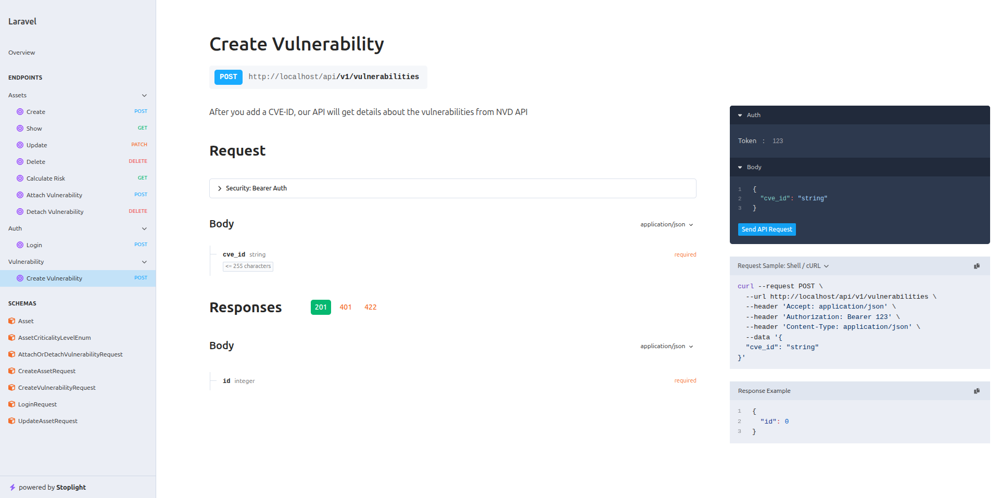

Asset Vulnerability Scanner
--
This API is designed to assist users in managing their assets and linking them to known security vulnerabilities,
providing calculated risk scores and detailed security intelligence.
Once a vulnerability is register by your [Common Vulnerabilities and Exposures Identifier (CVE-ID)](https://www.cve.org/) on our database, our system automatically find the

## Key Features
- Asset Management (CRUD): Full management capabilities for user assets (servers, software, devices).
- Vulnerability Linking: Allows users to associate known vulnerabilities via their [Common Vulnerabilities and Exposures Identifier (CVE-ID)](https://www.cve.org/) with specific assets.
- Automated Enrichment: Upon registration, the system automatically fetches and saves vulnerability details from [NVD CVE API](https://nvd.nist.gov/developers/vulnerabilities).
- Risk Calculation: Aggregated risk scores are calculated based on the asset's intrinsic criticality and the [Common Vulnerability Scoring System(CVSS)](https://nvd.nist.gov/vuln-metrics/cvss) scores of associated CVEs.

## Running Locally with Docker
If you have Make installed on your system, the setup is straightforward:

1. **Build and Start:** Run `make build` in the root directory.
   - Note: This command handles building containers, installing Composer dependencies, and running initial migrations.
2. **Access:** The API will be available on port 8000. You can access the API documentation at:
   - http://localhost/docs/api/
3. **Run Requests:** The API includes pre-defined requests for testing, available at [docs.](docs)
   - The [Postman Collection](https://www.postman.com/product/collections/) is available at
[docs/api_requests.postman_collection.json](docs/api_requests.postman_collection.json)
   - The [PhpStorm/IntelliJ Collection](https://www.jetbrains.com/help/phpstorm/http-client-in-product-code-editor.html)
is available at [docs/api_requests.http](docs/api_requests.http)
4. **Run tests**: The api include Unit Tests and Feature tests, you can check it running `make test` in the root
directory.

## API Architecture and Design

The API was built leveraging the principles of **Clean Architecture** and **SOLID**, focusing on maintainability,
testability, and clear separation of concerns.

### Decoupling and Inversion of Control (IoC)

* **Clean Architecture Base:** Business logic is primarily isolated within **Use Cases** (Application Layer). The design
rigorously adheres to the **Single Responsibility Principle (SRP)**, ensuring **each Use Case has only one objective**.
* **Dependency Inversion (DIP):** The design adheres to SOLID principles, notably the **Dependency Inversion Principle**,
by programming against abstractions (Interfaces) rather than concrete implementations (e.g., Repositories, API Clients).

### Robustness and Asynchronous Processing (Event-Driven)

The system utilizes an **Event-Driven Architecture (EDA)** to increase the **robustness** and **speed** of the API:

* **Delegation via Events:** Instead of synchronous calls, secondary actions (like sending facts to
[ClickHouse](https://clickhouse.com/) or fetching external API data)
are **delegated to an Event Queue**. This keeps the primary Use Case fast and isolated.
  - Example: [RecordVulnerabilityFact](app/Listeners/RecordVulnerabilityFact.php) and
[RecordAssetVulnerabilityFact](app/Listeners/RecordAssetVulnerabilityFact.php)
* **Messaging System:** The system uses Laravel's event/queue system, utilizing [Redis](https://redis.io/) as the
message broker.
* **Background Jobs:** Network-intensive tasks, such as accessing the external NVD API for vulnerability enrichment,
and the process of sending analytical facts to **ClickHouse**, are executed in *background jobs*.
    - Example: [StartVulnerabilityEnrichment.php](app/Listeners/StartVulnerabilityEnrichment.php)
* **Benefit:** This approach significantly reduces latency for the end-user, ensuring a near-instantaneous response for
resource creation.

## 👁️ Observability and Monitoring (Datadog Integration)

The application is fully integrated with **Datadog** to ensure comprehensive observability across the entire stack,
from container performance to application latency and structured logging. This is crucial for maintaining high
reliability and performance in an event-driven architecture.

### 1. Infrastructure Monitoring (Containers)

We use the Datadog Agent, deployed as a container, to collect host and container-level metrics.
This provides full visibility into the health and resource consumption of the underlying infrastructure.

* **View:** The standard Docker Dashboard in Datadog monitors resource usage per container instance.
  
* **Metrics Tracked:** CPU Utilization, Memory Consumption, Network Traffic, and Disk I/O for the `api`, `db`, `nginx`, and `clickhouse` services.
    

### 2. Application Performance and Latency

The system tracks application performance and latency using custom metrics and APM (Application Performance Monitoring)
to identify and troubleshoot slow requests, particularly those involving external services (NVD API)
or database operations.

* **Metric Monitored:** **Request Latency (Time to Serve)**. This is a key indicator that validates the speed benefit
of the asynchronous queue system.
* **Insight:** By monitoring API request time, we confirm that the latency remains low, ensuring the effectiveness of
delegating tasks to the background.
* ****

### 3. Centralized Structured Logging

All application logs (from PHP/Laravel and the message queue) are sent directly to Datadog's Log Management platform.

* **Integration:** Laravel's logging system is configured to send structured JSON logs (via Monolog/TCP) to Datadog.

### Automatic Documentation (Scramble)

The API documentation is automatically generated from the code using [Scramble](http://scramble.dedoc.co/), ensuring
it is always synchronized with the latest routes, request bodies, and responses defined in the Laravel controllers
and requests.
* **Access:** The interactive Swagger/OpenAPI documentation is available locally at `/docs/api`.

